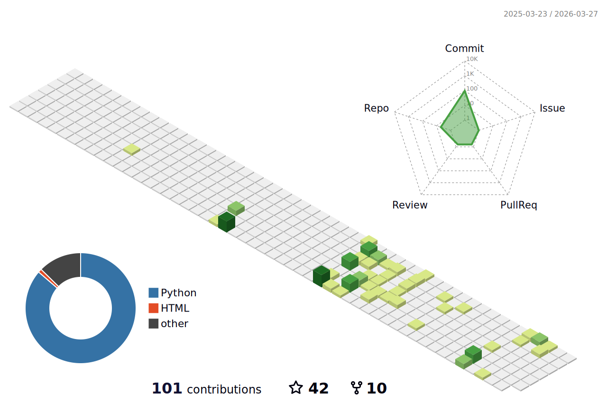

<p align="center">
    
  <h2 align="center">MengFanjun</h2>
   [](https://git.io/typing-svg)
  <p align="center"><a href="https://mfjblog.top" target="_blank" rel="noopener noreferrer"></a></p>
  <p align="center"> 读书破万卷</p>
</p>


<p align="center">
<a href="https://mengfanjun020906.github.io/">
  
</a>
</p>

<p align="center">
<a href="https://mengfanjun020906.github.io/">
  
</a>
</p>

<!--START_SECTION:waka-->


📅 **I'm Most Productive on Tuesday** 

```text
Monday                   53 commits          █████░░░░░░░░░░░░░░░░░░░░   19.85 % 
Tuesday                  65 commits          ██████░░░░░░░░░░░░░░░░░░░   24.34 % 
Wednesday                59 commits          ██████░░░░░░░░░░░░░░░░░░░   22.10 % 
Thursday                 31 commits          ███░░░░░░░░░░░░░░░░░░░░░░   11.61 % 
Friday                   21 commits          ██░░░░░░░░░░░░░░░░░░░░░░░   07.87 % 
Saturday                 25 commits          ██░░░░░░░░░░░░░░░░░░░░░░░   09.36 % 
Sunday                   13 commits          █░░░░░░░░░░░░░░░░░░░░░░░░   04.87 % 
```


📊 **This Week I Spent My Time On** 

```text
🕑︎ Time Zone: Asia/Shanghai

💬 Programming Languages: 
No Activity Tracked This Week

🔥 Editors: 
No Activity Tracked This Week

💻 Operating System: 
No Activity Tracked This Week
```


 Last Updated on 09/03/2024 12:14:05 UTC
<!--END_SECTION:waka-->


<h3 align="center">Languages and Tools:</h3>
<p align="center"> <a href="https://www.arduino.cc/" target="_blank" rel="noreferrer">  </a> <a href="https://www.gnu.org/software/bash/" target="_blank" rel="noreferrer">  </a> <a href="https://www.cprogramming.com/" target="_blank" rel="noreferrer">  </a> <a href="https://www.w3schools.com/cpp/" target="_blank" rel="noreferrer">  </a> <a href="hexo.io/" target="_blank" rel="noreferrer">  </a> <a href="https://www.linux.org/" target="_blank" rel="noreferrer">  </a> <a href="https://www.mathworks.com/" target="_blank" rel="noreferrer">  </a> <a href="https://www.python.org" target="_blank" rel="noreferrer">  </a> <a href="https://pytorch.org/" target="_blank" rel="noreferrer">  </a> </p>


<h2 align="left">Metrics</h2>




# Hi，there is MengFanjun👋
- 大四通信工程专业在读
- 这是我的[博客](https://mfjblog.top)，里面大部分是我的学习记录，后来想了想，博客也可以记录些个人的生活什么的
- 我的[邮箱](mailto:mengfanjun_020906@outlook.com)，大家有什么问题可以与我联系
- 我主要是做嵌入式多一点，人工智能和html什么的，也只能算得上了解
- 目前在**备战考研**和**学FPGA**
- 这些仓库和博客也可以说是我大学路上的见证者
- **持续创作，持续输出，做一个终身学习者**
