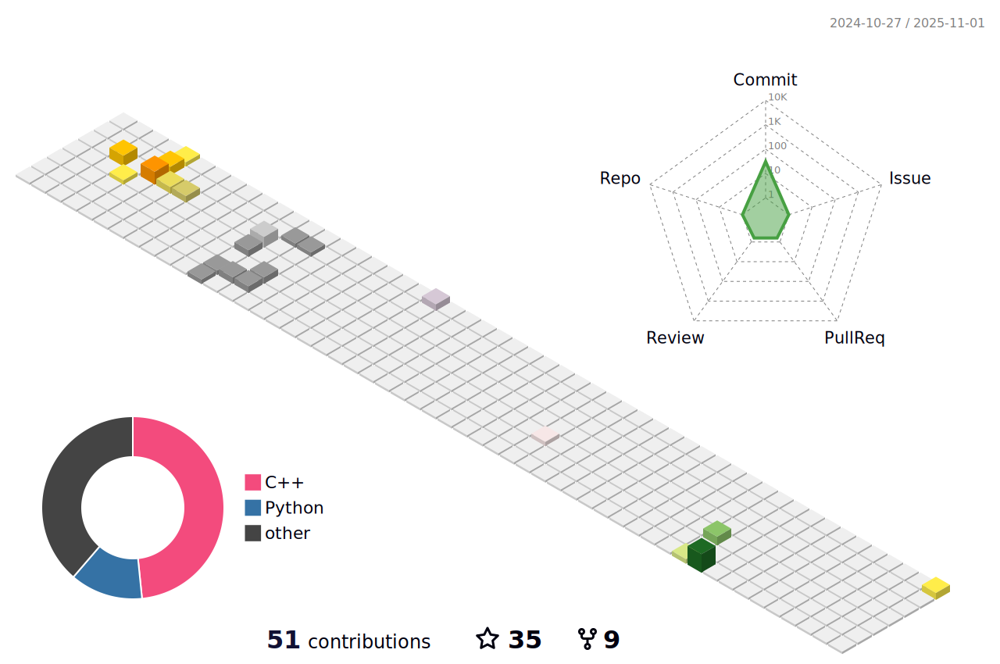

<h3 align="center">
  <a href="https://git.io/typing-svg">
    <!--      -->
    
  </a>
  </h1>


# Hi,there is MengFanjun👋
- A student from China.🇨🇳
- Senior majoring in communication engineering
- This is my [blog](https://mfjblog.top), most of which is my study record, later thought, blog can also record some personal life what
- My [email](mengfanjun_020906@outlook.com), please contact me if you have any questions
- I mainly do embedded programming, artificial intelligence and other aspects
- Currently studying **Transformer**.
- I am currently an intern at **Kuaishou**.
- These warehouses and blogs are also my witnesses on the way to college
- **Continue to create, continue to output, be a lifelong learner**


 


<a href="https://mfjblog.top" target="_blank" rel="noopener noreferrer"></a>


<a href="https://mengfanjun020906.github.io/">
  
</a>


<a href="https://mengfanjun020906.github.io/">
  
</a>

<h2 align="left">Coding Stats</h2>

<!--START_SECTION:waka-->


📅 **I'm Most Productive on Tuesday** 

```text
Monday                   37 commits          ███░░░░░░░░░░░░░░░░░░░░░░   12.21 % 
Tuesday                  68 commits          ██████░░░░░░░░░░░░░░░░░░░   22.44 % 
Wednesday                65 commits          █████░░░░░░░░░░░░░░░░░░░░   21.45 % 
Thursday                 38 commits          ███░░░░░░░░░░░░░░░░░░░░░░   12.54 % 
Friday                   28 commits          ██░░░░░░░░░░░░░░░░░░░░░░░   09.24 % 
Saturday                 43 commits          ████░░░░░░░░░░░░░░░░░░░░░   14.19 % 
Sunday                   24 commits          ██░░░░░░░░░░░░░░░░░░░░░░░   07.92 % 
```


📊 **This Week I Spent My Time On** 

```text
🕑︎ Time Zone: Asia/Shanghai

💬 Programming Languages: 
Other                    58 hrs 22 mins      █████████████████████████   99.94 % 
Python                   2 mins              ░░░░░░░░░░░░░░░░░░░░░░░░░   00.06 % 

🔥 Editors: 
Chrome                   58 hrs 24 mins      █████████████████████████   100.00 % 

💻 Operating System: 
Mac                      44 hrs 20 mins      ███████████████████░░░░░░   75.91 % 
Windows                  14 hrs 4 mins       ██████░░░░░░░░░░░░░░░░░░░   24.09 % 
```


 Last Updated on 29/08/2025 16:45:29 UTC
<!--END_SECTION:waka-->
<h2 align="left">Metrics</h2>




<h2 align="left">Languages and Tools</h2>

<p align="left">
  <a href="https://www.cprogramming.com/" target="_blank" rel="noreferrer">
    
  </a>
  <a href="https://www.w3schools.com/cpp/" target="_blank" rel="noreferrer">
    
  </a>
<a href="https://www.python.org" target="_blank" rel="noreferrer">
    
  </a>
  <a href="https://www.w3.org/html/" target="_blank" rel="noreferrer">
    
  </a>
  <a href="https://www.w3schools.com/css/" target="_blank" rel="noreferrer">
    
      <a href="https://pytorch.org/" target="_blank" rel="noreferrer">
    
  </a>
    <a href="https://git-scm.com/" target="_blank" rel="noreferrer">
    
  </a>
   <a href="https://zh.wikipedia.org/zh-tw/Linux" target="_blank" rel="noreferrer">
    
  </a> 
   <a href="https://www.arduino.cc/" target="_blank" rel="noreferrer">
    
  </a> 
     <a href="https://www.st.com/en/microcontrollers-microprocessors/stm32-32-bit-arm-cortex-mcus.html" target="_blank" rel="noreferrer">
    
  </a> 
       <a href="https://lceda.cn/" target="_blank" rel="noreferrer">
    
  </a> 
         <a href="https://hexo.io/zh-cn/index.html/" target="_blank" rel="noreferrer">
    
  </a> 
           <a href="https://www.latex-project.org/" target="_blank" rel="noreferrer">
    
  </a> 
             <a href="https://www.altium.com/altium-designer" target="_blank" rel="noreferrer">
    
  </a> 
               <a href="https://www.ni.com/en/support/downloads/software-products/download.multisim.htm" target="_blank" rel="noreferrer">
    
  </a> 
                 <a href="https://www.ni.com/en-us/shop/labview.html" target="_blank" rel="noreferrer">
    
  </a> 
                 <a href="https://ubuntu.com/download" target="_blank" rel="noreferrer">
    
  </a> 
                   <a href="https://vercel.com/" target="_blank" rel="noreferrer">
    
  </a> 
                   <a href="https://cn.aliyun.com/" target="_blank" rel="noreferrer">
    
  </a> 
                       <a href="https://www.markdownguide.org/" target="_blank" rel="noreferrer">
    
  </a> 
                         <a href="https://www.labcenter.com/" target="_blank" rel="noreferrer">
    
  </a> 
                         <a href="https://www.labcenter.com/" target="_blank" rel="noreferrer">
    
  </a> 
    
  <h3 align="left">Recently Learning</h3>
     <a href="https://www.docker.com" target="_blank" rel="noreferrer">
    
  </a>

  
  
  


<!-- Connect with me -->
<h2 align="left">Connect with me</h2>
<p align="left">
  <a href="https://github.com/Mengfanjun020906"
    target="blank">
      <a href="https://www.zhihu.com/people/bu-shi-hen-sha-31"
    target="blank">
              <a href="https://twitter.com/Solitude63420"
    target="blank">
  </a>
                <a href="https://gitee.com/meng-fanjun-123"
    target="blank">
  </a>
                  <a href="https://www.kaggle.com/funjunmeng"
    target="blank">
  </a>

  <h2 align="left">Counter</h2>
<a href="https://github.com/antonkomarev/github-profile-views-counter">
  
</a>
